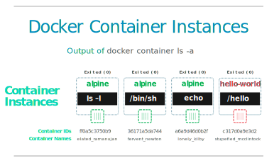
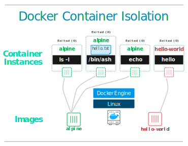
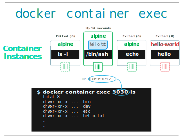

Run Alpine Linux Containers
=============================

In this lab you will run a  container and explore the basics of how containers work, how the Docker Engine executes and isolates containers from each other.   You must have docker installed on your system before continuing, [quikstart install for Ubuntu 20.04](ubuntu-install-docker.io.md)  or [full instructions here](https://docs.docker.com/get-docker/)

* * *

Concepts in this exercise:

*   Docker engine
*   Containers & images
*   Image registries and Docker Hub
*   Container isolation

* * *
Note:  This lab is originally from [play with docker](https://training.play-with-docker.com/ops-s1-hello/)  where you can use the console in a browser.  I updated the commands and fixed a few things.

Tips:

Code snippets are shown in one of three ways throughout this environment:

1.  Code that looks like `this` is sample code snippets that is usually part of an explanation.
2.  Code that appears in a window like the one below should be typed in as shown.
    
        uname -a
        
    
3.  Code appearing in a window like the one below is code that you should type in , there is a part we can't supply because it is specific to your runtime. Items appearing in <> are the pieces you should substitute based on the instructions.
    
        docker start <container ID>
        
    
1.0 Running your first container
--------------------------------

It’s time to get your hands dirty! As with all things technical, a “hello world” app is good place to start. Type or click the code below to run your first Docker container:

    docker run hello-world
    

That’s it: your first container. The _hello-world_ container output tells you a bit about what just happened. Essentially, the Docker engine running in your terminal tried to find an **image** named hello-world. Since you just got started there are no images stored locally (`Unable to find image...`) so Docker engine goes to its default **Docker registry**, which is [Docker Hub](https://hub.docker.com), to look for an image named “hello-world”. It finds the image there, pulls it down, and then runs it in a container. And hello-world’s only function is to output the text you see in your terminal, after which the container exits.

If you are familiar with VMs, you may be thinking this is pretty much just like running a virtual machine, except with a central repository of VM images. And in this simple example, that is basically true. But as you go through these exercises you will start to see important ways that Docker and containers differ from VMs. For now, the simple explanation is this:

*   The VM is a _hardware_ abstraction: it takes physical CPUs and RAM from a host, and divides and shares it across several smaller virtual machines. There is an OS and application running inside the VM, but the virtualization software usually has no real knowledge of that.
*   A container is an _application_ abstraction: the focus is really on the OS and the application, and not so much the hardware abstraction. Many customers actually use both VMs and containers today in their environments and, in fact, may run containers inside of VMs.

1.1 Docker Images
-----------------

In this rest of this lab, you are going to run an [Alpine Linux](http://www.alpinelinux.org/) container. Alpine is a lightweight Linux distribution so it is quick to pull down and run, making it a popular starting point for many other images.

To get started, let’s run the following in our terminal:

    docker pull alpine
    

The `pull` command fetches the alpine **image** from the **Docker registry** and saves it in our system. In this case the registry is **[Docker Hub](https://hub.docker.com)**. You can change the registry, but that’s a different lab.

You can use the `docker images` command to see a list of all images on your system.

    docker images
    

    REPOSITORY               TAG       IMAGE ID       CREATED        SIZE
    alpine                   latest    6dbb9cc54074   2 weeks ago    5.61MB
    hello-world              latest    d1165f221234   2 months ago   13.3kB

1.2 Docker Containers (run time)
--------------------------------

Great! Let’s now run a Docker **container** based on this image. To do that you are going to use the `docker run` command.

    docker run alpine ls -l
    

    total 48
    drwxr-xr-x    2 root     root          4096 Mar  2 16:20 bin
    drwxr-xr-x    5 root     root           360 Mar 18 09:47 dev
    drwxr-xr-x   13 root     root          4096 Mar 18 09:47 etc
    drwxr-xr-x    2 root     root          4096 Mar  2 16:20 home
    drwxr-xr-x    5 root     root          4096 Mar  2 16:20 lib
    ......
    ......
    

While the output of the `ls` command may not be all that exciting, behind the scenes quite a few things just took place. When you call `run`, the Docker client finds the image (alpine in this case), creates the container and then runs a command in that container. When you run `docker run alpine`, you provided a command (`ls -l`), so Docker executed this command inside the container for which you saw the directory listing. After the `ls` command finished, the container shut down.

The fact that the container exited after running our command is important, as you will start to see. Let’s try something more exciting. Type in the following:

    docker run alpine echo "hello from alpine"
    

And you should get the following output:

    hello from alpine
    

In this case, the Docker client dutifully ran the `echo` command inside our alpine container and then exited. If you noticed, all of that happened pretty quickly and again our container exited. As you will see in a few more steps, the `echo` command ran in a separate container instance. Imagine booting up a virtual machine (VM), running a command and then killing it; it would take a minute or two just to boot the VM before running the command. A VM has to emulate a full hardware stack, boot an operating system, and then launch your app - it’s a virtualized _hardware_ environment. Docker containers function at the application layer so they skip most of the steps VMs require and just run what is required for the app. Now you know why they say containers are fast!

Try another command.

    docker run alpine /bin/sh
    

Wait, nothing happened! Is that a bug? No! In fact, something did happen. You started a 3rd instance of the alpine container and it ran the command `/bin/sh` and then exited. You did not supply any additional commands to `/bin/sh` so it just launched the shell, exited the shell, and then stopped the container. What you might have _expected_ was an interactive shell where you could type some commands. Docker has a facility for that by adding a flag to run the container in an interactive terminal. For this example, type the following:

     docker run -it alpine /bin/sh
    

You are now inside the container running a Linux shell and you can try out a few commands like `ls -l`, `uname -a` and others. Note that Alpine is a small Linux OS so several commands might be missing. Exit out of the shell and container by typing the `exit` command.

Ok, we said that we had run each of our commands above in a separate container instance. We can see these instances using the `docker ps` command. The `docker ps` command by itself shows you all containers that are currently running:

    docker ps
    

    CONTAINER ID        IMAGE               COMMAND             CREATED             STATUS              PORTS               NAMES
    

Since no containers are running, you see a blank line. Let’s try a more useful variant: `docker ps -a`

    docker ps -a
    

    CONTAINER ID        IMAGE               COMMAND                  CREATED             STATUS                      PORTS               NAMES
    36171a5da744        alpine              "/bin/sh"                5 minutes ago       Exited (0) 2 minutes ago                        fervent_newton
    a6a9d46d0b2f        alpine             "echo 'hello from alp"    6 minutes ago       Exited (0) 6 minutes ago                        lonely_kilby
    ff0a5c3750b9        alpine             "ls -l"                   8 minutes ago       Exited (0) 8 minutes ago                        elated_ramanujan
    c317d0a9e3d2        hello-world         "/hello"                 34 seconds ago      Exited (0) 12 minutes ago                       stupefied_mcclintock
    

What you see now is a list of all containers that you ran. Notice that the `STATUS` column shows that these containers exited some time ago.

Here is the same output of the `docker ps -a` command, shown diagrammatically (note that your container IDs and names will be different):

It makes sense to spend some time getting comfortable with the `docker run` commands. To find out more about `run`, use `docker run --help` to see a list of all flags it supports. As you proceed further, we’ll see a few more variants of `docker run` but feel free to experiment here before proceeding.

1.3 Container Isolation
-----------------------

In the steps above we ran several commands via container instances with the help of `docker run`. The `docker ps -a` command showed us that there were several containers listed. Why are there so many containers listed if they are all from the _alpine_ image?

This is a critical security concept in the world of Docker containers! Even though each `docker run` command used the same alpine **_image_**, each execution was a separate, isolated **_container_**. Each container has a separate filesystem and runs in a different namespace; by default a container has no way of interacting with other containers, even those from the same image. Let’s try another exercise to learn more about isolation.

    docker run -it alpine /bin/ash
    

The `/bin/ash` is another type of shell available in the alpine image. Once the container launches and you are at the container’s command prompt type the following commands:

     echo "hello world" > hello.txt
    
     ls
    

The first `echo` command creates a file called “hello.txt” with the words “hello world” inside it. The second command gives you a directory listing of the files and should show your newly created “hello.txt” file. Now type `exit` to leave this container.

To show how isolation works, run the following:

    docker run alpine ls
    

It is the same `ls` command we used inside the container’s interactive ash shell, but this time, did you notice that your “hello.txt” file is missing? That’s isolation! Your command ran in a new and separate _instance_, even though it is based on the same _image_. The 2nd instance has no way of interacting with the 1st instance because the Docker Engine keeps them separated and we have not setup any extra parameters that would enable these two instances to interact.

In every day work, Docker users take advantage of this feature not only for security, but to test the effects of making application changes. Isolation allows users to quickly create separate, isolated test copies of an application or service and have them run side-by-side without interfering with one another. In fact, there is a whole lifecycle where users take their changes and move them up to production using this basic concept and the built-in capabilities of Docker Enteprise. We will explore more of that in later exercises.

Right now, the obvious question is “how do I get back to the container that has my ‘hello.txt’ file?”

Once again run the

    docker ps -a
    

command again and you should see output similar to the following:

    CONTAINER ID        IMAGE               COMMAND                  CREATED             STATUS                      PORTS               NAMES
    36171a5da744        alpine              "ls"                     2 minutes ago       Exited (0) 2 minutes ago                        distracted_bhaskara
    3030c9c91e12        alpine              "/bin/ash"               5 minutes ago       Exited (0) 2 minutes ago                        fervent_newton
    a6a9d46d0b2f        alpine             "echo 'hello from alp"    6 minutes ago       Exited (0) 6 minutes ago                        lonely_kilby
    ff0a5c3750b9        alpine             "ls -l"                   8 minutes ago       Exited (0) 8 minutes ago                        elated_ramanujan
    c317d0a9e3d2        hello-world         "/hello"                 34 seconds ago      Exited (0) 12 minutes ago                       stupefied_mcclintock
    

Graphically this is what happened on our Docker Engine: 

The container in which we created the “hello.txt” file is the same one where we used the `/bin/ash` shell, which we can see listed in the “COMMAND” column. The _Container ID_ number from the first column uniquely identifies that particular container instance. In the sample output above the container ID is `3030c9c91e12`. We can use a slightly different command to tell Docker to run this specific container instance. Try typing:

    docker start <container ID>
    

*   **Pro tip:** Instead of using the full container ID you can use just the first few characters, as long as they are enough to uniquely ID a container. So we could simply use “3030” to identify the container instance in the example above, since no other containers in this list start with these characters.

Now use the `docker ps` command again to list the running containers.

    CONTAINER ID        IMAGE               COMMAND                  CREATED             STATUS                      PORTS               NAMES
    3030c9c91e12        alpine              "/bin/ash"                2 minutes ago       Up 14 seconds                        distracted_bhaskara
    

Notice this time that our container instance is still running. We used the ash shell this time so the rather than simply exiting the way /bin/sh did earlier, ash waits for a command. We can send a command in to the container to run by using the `exec` command, as follows:

    docker exec <container ID> ls
    

This time we get a directory listing and it shows our “hello.txt” file because we used the container instance where we created that file.

1.4 Terminology
---------------

You just saw a lot of Docker-specific jargon which might be confusing. So let’s clarify some terminology that is used frequently in the Docker ecosystem.

*   _Images_ - The file system and configuration of our application which are used to create containers. To find out more about a Docker image, run `docker inspect alpine`. In the demo above, you used the `docker pull` command to download the **alpine** image. When you executed the command `docker run hello-world`, it also did a `docker pull` behind the scenes to download the **hello-world** image.
*   _Containers_ - Running instances of Docker images — containers run the actual applications. A container includes an application and all of its dependencies. It shares the kernel with other containers, and runs as an isolated process in user space on the host OS. You created a container using `docker run` which you did using the alpine image that you downloaded. A list of running containers can be seen using the `docker  ls` command.
*   _Docker daemon_ - The background service (`dockerd` on *nix) running on the host that manages building, running and distributing Docker containers.
*   _Docker client_ - The command line tool that allows the user to interact with the Docker daemon.
*   _Docker Hub_ - Is, among other things, a [registry](https://hub.docker.com/) of Docker images. You can think of the registry as a directory of all available Docker images. 
