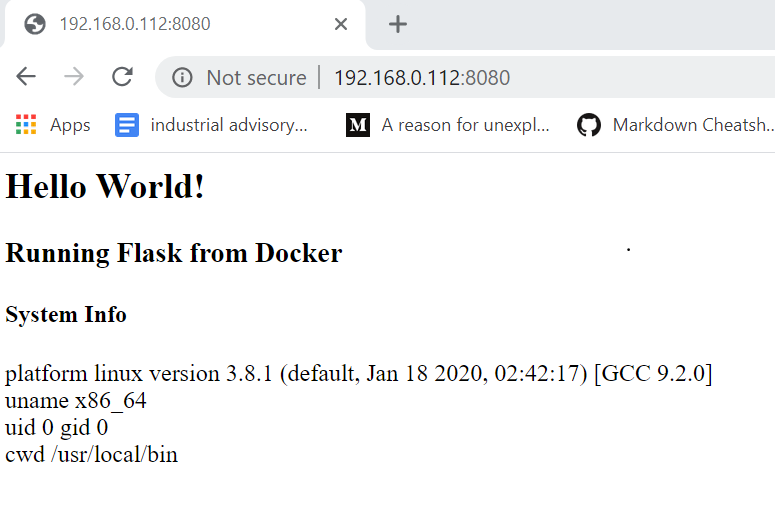

# flaskpoc

This is a proof of concept single container app.  It uses a python alpine image + Flask to set up a web app.   


todo set up prod (copy to image,as current [Dockerfile](#Dockerfile)) & dev mount local volume so can manipulate as we run

## install docker
If you plan to run this image locally install docker (it may also be run from any of the major cloud providers such as AWS, Azure, Google Cloud and some others such as heroku and openshift.

[Install](https://docs.docker.com/install/)  

If you are newly learning docker I suggest you use the command line interface as it may be used anywhere. 
## docker registry image repo

It is available as a public image in my repo https://hub.docker.com/repository/docker/tricia/flaskpoc
### running a container from a hub image:
If you don't want to clone this gihub repo you can run this image (provided docker is installed) use this command change hostport to whatever you want (high is eaiser wrt firewalls) docker will do port forwarding for you:
```
docker run -p hostport:5000 tricia/flaskpoc
```
To access the app load a browser and use localhost or your ip address `localhost:hostport` or `your.ip.address:hostport`   
In the following screenshot the command run was `docker run -p 8080:5000 tricia/flaskpoc` so access is form port 8080 on the host running docker.  


If you run the preceding docker command the container will have control of the shell and you will see error or debut messages.  In order to run the app in a headless manner you must `-d` detach:
```
docker run -d -p hostport:5000 tricia/flaskpoc
```
### shell into a running container
While the host is running you can shell into it if you wish, to see what is going on, if you run `docker ps` you will see the container name on the left: 
```
docker exec -it containernamehere sh
```

note: If you have newly install docker, on \*nix, in order to run docker as a regular user you must add your userid to the docker group (then restart the shell) `sudo usermod -aG docker youruserid`  To check this you should see it as your group when you run `id`

## Dockerfile 
See [Dockerfile with explanations](Dockerfile.md)

## Scripts (install docker before using)
### [run.from.hub.sh](run.from.hub.sh)
This script will pull the public image and run it. 
### [build.run.sh](build.run.sh)
This script will build the image from the Dockerfile in this repo, then run it.

