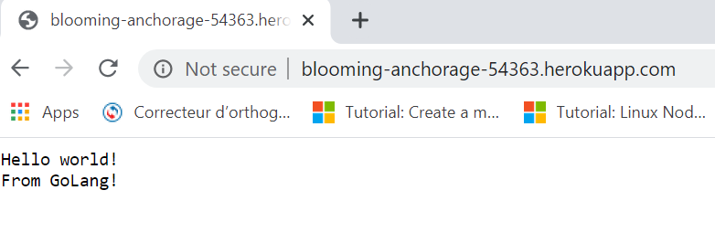

# testing heroku deploy  container
Testing with basic golang app from here

ref https://medium.com/travis-on-docker/how-to-run-dockerized-apps-on-heroku-and-its-pretty-great-76e07e610e22


todo use docker to deploy
# Create main.go & Dockerfile with content
see files in this dir
# docker build
```
$  docker build -t tricia/goheroku
```
# Test locally
```
$ docker run  -d -it -p 8888:8080 tricia/goheroku -name goheroku
```
# deploy using heroku cli (already installed) 
1. `heroku login`	login to heroku 
1. `heroku push`   push to registry
1. `heroku release`  release to web
1. load a browser, _appname_.herokuapp.com
## Login to heroku
```
tricia@acerubuntu1804:~/ecq/docker-ecq2020/hello-world-go-heroku$ heroku login -i
heroku: Enter your login credentials
Email: pcampbell.edu@gmail.com
Password: *********
Logged in as pcampbell.edu@gmail.com
Create an heroku app
tricia@acerubuntu1804:~/ecq/docker-ecq2020/hello-world-go-heroku$ heroku create
Creating app... done, ⬢ blooming-anchorage-54363
https://blooming-anchorage-54363.herokuapp.com/ | https://git.heroku.com/blooming-anchorage-54363.git
```
## heroku push
```
tricia@acerubuntu1804:~/ecq/docker-ecq2020/hello-world-go-heroku$ heroku container:push web --app blooming-anchorage-54363
=== Building web (/home/tricia/ecq/docker-ecq2020/hello-world-go-heroku/Dockerfile)
Sending build context to Docker daemon  3.072kB
Step 1/7 : FROM golang:alpine AS build-env
 ---> 51e47ee4db58
Step 2/7 : ADD . /src
 ---> b9946e07fb32
Step 3/7 : RUN cd /src && go build -o goapp
 ---> Running in 62dc7a5b4a4d
Removing intermediate container 62dc7a5b4a4d
 ---> e7088c6b2d6c
Step 4/7 : FROM alpine
 ---> e7d92cdc71fe
Step 5/7 : WORKDIR /app
 ---> Using cache
 ---> b80a3bd6bd74
Step 6/7 : COPY --from=build-env /src/goapp /app/
 ---> 67eeb89d64ae
Step 7/7 : CMD ./goapp
 ---> Running in 3c2d7ebbd40f
Removing intermediate container 3c2d7ebbd40f
 ---> d712eb92cea3
Successfully built d712eb92cea3
Successfully tagged registry.heroku.com/blooming-anchorage-54363/web:latest
=== Pushing web (/home/tricia/ecq/docker-ecq2020/hello-world-go-heroku/Dockerfile)
The push refers to repository [registry.heroku.com/blooming-anchorage-54363/web]
6943e3de6191: Pushed
60ed30d9dc7b: Pushed
5216338b40a7: Pushed
latest: digest: sha256:289fb22df9b7132056da501556ed64c6d06b032083aa1f9398aadd3e2d2c0311 size: 946
Your image has been successfully pushed. You can now release it with the 'container:release' command.
```
## heroku release
```
tricia@acerubuntu1804:~/ecq/docker-ecq2020/hello-world-go-heroku$ heroku container:release web --app blooming-anchorage-54363
Releasing images web to blooming-anchorage-54363... done
```
## load the app 
`https://bloming-ancohorage-54363.herokuapp.com`

It worked!


# deploy using docker to heroku  
1. `docker login`	login to heroku 
1. `heroku tag`  tag for push
1. `docker push`   push to registry
1. load a browser, _appname_.herokuapp.com

