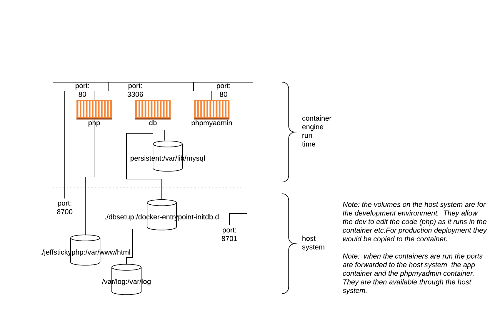

#  stickynotes-jb
This is a proof of concept containerized PHP app.   The code was written by J Boisvert & ?  as an
assignment given by J. Nilakantan @ Dawson College for the Computer Science PHP course in the 3rd year PHP course Fall 2019.  

My thanks to everyone for lending me their work.

It uses a PHP & apache image + mysql db

This is the first app using multiple containers & docker compose 
* https://hub.docker.com/_/mysql/ 
* https://docs.docker.com/compose/compose-file/
* https://docs.docker.com/compose/gettingstarted/

# NOTE WORKING ON LOCAL BOX 2020-03-01
This is a multi container setup for development, there are several volumes mapped to the localhost to aide testing & dev.  Some would be changed for a production deployment

# TODO PUSH IMAGE TO REGISTRY
# TODO COMPLETE THIS DOC
# TODO NOTE this readme is not complete, do not use it yet 2020-03-01
## TL;DR
### To run this app
1. install docker https://docs.docker.com/install/ 
    * on *nix you will need to add your user to the docker group to run as a regular user `sudo usermod -aG docker youruserid`
2. install docker-compose https://docs.docker.com/compose/install/
2. run `docker-compose  up  -d -p ` 
    * 80 is the container port and 8888 is the host that is running docker, port forwarding from
 container 80 to host 8888 is done by docker, choose a high port if you don't want 8888
    * \-d detaches the container, if you omit you will see the startup and the apache output
3. load a browser to access the app `localhost:8888` or `ip.address.of.host:8888`
### To build a container  (general info)
1.  install docker https://docs.docker.com/install/
2.  create a Dockerfile that uses an appropriate base image & installs the software you need.  See here for the [Dockerfile](Dockerfile.md) with explanations that was used to create this app.
    * Dockerfile reference https://docs.docker.com/engine/reference/builder/
3.  build the image, run `docker build -t **containerimagename** .` (tweak Dockerfile until it works!)
4.  run the container, run `docker run containerimagename`       to test it.
**__Note__** If you are newly learning docker I __strongly__ suggest you use the command line interface as it may be used anywhere: windoze, *nix, and cloud shells.  No need to learn new interfaces every time.

## docker registry image repo
It is available as a public image in my repo 
https://hub.docker.com/repository/docker/tricia/stickynotes-jb

### running an image
If you don't want to clone this repo to use my scripts you can run this image (provided docker is installed) use this command change hostport to whatever you want (high is eaiser wrt firewalls) docker will do port forwarding for you:
```
docker run -p hostport:80 tricia/stickynotes-jb
```
For example  `docker run -d -p 8088:80 tricia/stickynotes-jb` access via a browser http://localhost:8088 
### running on cloud
You cannot pull from docker hub without docker AFAICT, each cloud provider has it's own registry if you want to use any of those you will have to set up an account & use the Dockerfile & app to create your own image in the cloud's own registry.  I will add this information elsewhere.
## Creating a container image (docker compose & Dockerfiles)
Multi container apps use docker compose yaml and Dockerfiles

todo insert info

See here for the [docker compose yaml](docker-compose.yaml.md) that pulls it all together, with explanations that was used to create this app.

See here for the [php & apache Dockerfile](php/Dockerfile.md) with explanations that was used to create this app.

### docker commands
see  [common docker commands](DOCKERCMDS.md) 
### TODO `docker-compose commands
see  [common docker commands](DOCKERCOMPOSECMDS.md) 

